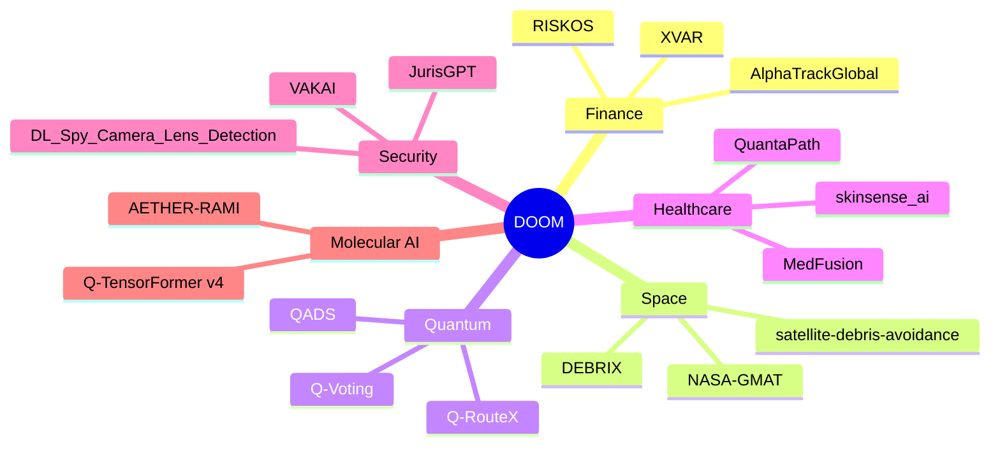

<div align="center">


<br/>

> *"Let the world tremble at what one mind, unbound by their limitations, can build."*

<br/>

<h1>
  
</h1>


<br/>


[](https://github.com/Premchandyadav369)

[](https://github.com/Premchandyadav369/RISKOS)


</div>

<div align="center">

```
SYSTEM STATUS ─────────────────────────────────────────
 CORE           : ONLINE
 RESEARCH QUEUE : ACTIVE
 THRONE ROOM    : RENDERING
 THREAT LEVEL   : MAXIMUM
────────────────────────────────────────────────────────
```

</div>

---

<table align="center">
<tr>
<td width="50%" valign="top">

```
╔═══════════════════════════════════════════╗
║  LATVERIAN RESEARCH ARCHIVE — CLASSIFIED   ║
╠═══════════════════════════════════════════╣
║ NAME     : V C Premchand Yadav             ║
║ TITLE    : Sovereign of Graph Neural Nets  ║
║ REALM    : Latveria                        ║
║ MISSION  : Bend data to my will            ║
║ REPOS    : 30+ domains under my banner     ║
║ STATUS   : Publishing. Building. Ruling.   ║
╚═══════════════════════════════════════════╝
```

</td>
<td width="50%" valign="top">


</td>
</tr>
</table>

---

## ⚡ THE DOOM MANIFESTO

> *"Stark builds toys for mortals. I build systems that outlive empires."*

I'm an ML Engineer, Data Scientist, and AI Researcher who moves fluidly between statistical rigor and deep, research-grade engineering — GNNs, transformers, and quantum-inspired algorithms — deployed across **agriculture, finance, healthcare, autonomous vehicles, cybersecurity, and space systems**. Co-author of peer-reviewed work in **IEEE** and **arXiv**, spanning edge AI, computer vision, and runtime safety verification for autonomous systems. My GitHub spans 30+ repositories across quantitative finance, orbital mechanics, quantum computing, drug discovery, and Indic-language AI security.

- 🏰 Founder, **RICE (Revolution In Cultivating Excellence)** — AgriTech AI, since Jun 2025
- 🛠️ Product Development Intern @ **SOUL** — since Apr 2025
- 🎓 B.Tech CSE (AI & ML), VIT-AP University — **9.35/10 CGPA**
- 🏆 Winner, **HybridHack** @ SRM Institute (2025)
- 📜 Co-Author, arXiv:2606.02967 — Project October Series (2026)
- 📍 Operating out of **Latveria** — coordinates classified

<br/>

🎯 **Currently building:** AETHER-RAMI molecular intelligence & Q-TensorFormer v4
🌱 **Currently deep in:** quantum-classical hybrid planning, constitutional AI safety for autonomous systems
💬 **Ask me about:** graph neural networks, quantum-inspired ML, drug discovery pipelines, autonomous system safety verification

---

<div align="center">

> *"I do not chase progress. Progress chases me, and it is always three papers behind."*

</div>

---

## 🩸 THE ARSENAL

<div align="center">

### 🧠 Deep Learning & Computer Vision


### 🕸️ Graph & Geometric Deep Learning


### 🌌 GenAI & LLM Tooling


### ⚛️ Quantum & Quantum-Inspired Computing


### 🤖 Multi-Agent & Decision Systems


### 🔧 Model Optimization & Edge AI
-1a3a2a?style=for-the-badge&logo=onnx&logoColor=00ff41)


### 🛡️ AI Safety & Governance


### 📊 Data Science & Statistics


### 💰 Quant Finance & Risk


### ☁️ Cloud, MLOps & Systems Simulation


### 💻 Core Programming & App Development


</div>

---

<div align="center">

> *"Every failed run is a lesson the universe owes me. I collect the debt in gradients."*

</div>

---

## 🧪 EXPERIMENTS FROM THE CASTLE LABORATORY

<table>
<tr>
<td width="50%">

### 🧬 AETHER-RAMI
**Molecular Intelligence Platform**
<br/>
GraphCL pretraining, GATv2Conv/GPS-Transformer encoders, protein-ligand cross-attention, and Drug-Protein CLIP across 5 protein targets. ESM-2 embeddings + protein-conditioned VAE + BALD active learning + dual FAISS indexing over PDBbind, BindingDB, MoleculeNet.

</td>
<td width="50%">

### 🛰️ DEBRIX
**Space Debris Mitigation System**
<br/>
Autonomous "Dock-and-Dump" cyber-physical system — YOLOv8 Edge-AI on Jetson hardware, fused with Unscented Kalman Filters. Multi-agent CBBA swarm coordination, verified in MATLAB & NASA GMAT.

</td>
</tr>
<tr>
<td width="50%">

### 🧠 MindTrace AI
**Cognitive Bias Detector**
<br/>
Transformer + XAI framework detecting cognitive biases and logical fallacies in text. Real-time correction layer with word-level bias visualization, zero-shot multilingual transfer across 13+ languages.

</td>
<td width="50%">

### ⚛️ Q-RouteX & QADS
**Quantum-Classical Hybrid Intelligence**
<br/>
Trust-aware quantum hypergraph routing with GAT/GraphSAGE + LSTM/Transformer forecasting + PPO + QAOA-inspired routing. QADS pairs PennyLane quantum circuits with A* and entropy-gated classical/quantum switching.

</td>
</tr>
<tr>
<td width="50%">

### 🔮 Q-TensorFormer v4
**Quantum-Inspired Adaptive Transformer**
<br/>
Tensor-Train-compressed 3-layer transformer — 87.6% parameter reduction, 73% mobile energy savings. Entanglement-Guided Rank Scheduler routes ambiguous tokens via Von Neumann entropy.

</td>
<td width="50%">

### 🩺 MedFusion
**Multimodal Clinical AI Assistant**
<br/>
MedGemma (local vision) + K2-Think-v2 (cloud reasoning), clinical risk calculators, FHIR R4 export, ICD-10/SNOMED coding, Gradio interface.

</td>
</tr>
</table>

---

<div align="center">

> *"Markets bow to volatility. I bow to no one — I model the volatility itself."*

</div>

---

## 💰 I. QUANTITATIVE FINANCE, RISK & TRADING

<table>
<tr><td width="18%"><b>💎 <a href="https://github.com/Premchandyadav369/RISKOS">RISKOS</a></b><br/><i>flagship</i></td><td width="82%">Institutional-grade quantitative risk intelligence, macro stress testing, and algorithmic trading workstation built for JPMorgan Chase CTC (Treasury/CIO) Risk Innovation. 25+ mathematical models — GARCH, 100k-scenario Monte Carlo, EVT/GPD, Treasury ALM/IRRBB, XVA Derivatives, Quantum QUBO Optimizer, 4-Agent Risk Committee. Stack: Python (FastAPI, NumPy, SciPy), Next.js 14, Tailwind CSS, TradingView Lightweight Charts.</td></tr>
<tr><td><b><a href="https://github.com/Premchandyadav369/quantum-financial-intelligence-v2">quantum-financial-intelligence-v2</a></b></td><td>Cross-border portfolio optimization engine comparing Classical Markowitz against Quantum Annealing across US and Indian equity markets, with AI-generated insights.</td></tr>
<tr><td><b><a href="https://github.com/Premchandyadav369/AlphaTrackGlobal">AlphaTrackGlobal</a></b></td><td>Multi-asset market analytics and execution platform inspired by the Bloomberg Terminal.</td></tr>
<tr><td><b><a href="https://github.com/Premchandyadav369/BudgetWise-AI">BudgetWise-AI</a></b></td><td>Personal wealth and budgeting assistant powered by Google Gemini and Streamlit.</td></tr>
<tr><td><b><a href="https://github.com/Premchandyadav369/XVAR">XVAR</a></b></td><td>Stochastic outcome simulator for predicting, stress-testing, and ranking financial/macro scenario outcomes.</td></tr>
</table>

---

<div align="center">

> *"Gravity is a suggestion. I have written code that argues with orbits and wins."*

</div>

---

## 🛰️ II. SPACE TECH & ORBITAL DEBRIS AVOIDANCE

<table>
<tr><td width="30%"><b><a href="https://github.com/Premchandyadav369/satellite-debris-avoidance">satellite-debris-avoidance</a></b></td><td width="70%">Autonomous spacecraft collision avoidance combining YOLOv8m object detection, KeepTrack orbit propagation, and K2-Think-V2 reasoning.</td></tr>
<tr><td><b><a href="https://github.com/Premchandyadav369/DEBRIX">DEBRIX</a> / <a href="https://github.com/Premchandyadav369/debrex-space-debris-capture">debrex-space-debris-capture</a></b></td><td>Autonomous active space debris capture and orbital tracking platform.</td></tr>
<tr><td><b><a href="https://github.com/Premchandyadav369/NASA-GMAT">NASA-GMAT</a></b></td><td>Orbital mission trajectories, delta-v maneuvers, and orbital mechanics simulations modeled using NASA's General Mission Analysis Tool.</td></tr>
<tr><td><b><a href="https://github.com/Premchandyadav369/SpaceStationSafetyDetector-1">SpaceStationSafetyDetector-1</a> / <a href="https://github.com/Premchandyadav369/SpaceFalconProject">SpaceFalconProject</a></b></td><td>Deep learning computer vision models for space station anomaly, hazard, and safety detection.</td></tr>
</table>

---

<div align="center">

> *"Deception wears many masks. I have built the mirror that unmasks them all."*

</div>

---

## 🛡️ IV. AI, CYBER SECURITY & INDIC LANGUAGE SYSTEMS

<table>
<tr><td width="30%"><b><a href="https://github.com/Premchandyadav369/VAKAI">VAKAI</a></b></td><td width="70%">Agentic AI voice detection platform engineered to protect Indic language ecosystems against generative audio deepfakes and voice spoofing.</td></tr>
<tr><td><b><a href="https://github.com/Premchandyadav369/JurisGPT">JurisGPT</a></b></td><td>AI legal research engine for Indian Constitutional and Penal Law integrating Qwen2, LegalBERT, and Retrieval-Augmented Generation.</td></tr>
<tr><td><b><a href="https://github.com/Premchandyadav369/CrawlMind">CrawlMind</a></b></td><td>Autonomous web crawling, content extraction, and unstructured data ingestion pipeline.</td></tr>
<tr><td><b><a href="https://github.com/Premchandyadav369/DL_Spy_Camera_Lens_Detection">DL_Spy_Camera_Lens_Detection</a></b></td><td>Optical computer vision model designed to detect hidden pinhole lenses and covert cameras.</td></tr>
<tr><td><b><a href="https://github.com/Premchandyadav369/bitchat">bitchat</a></b></td><td>Offline, decentralized peer-to-peer chat application running over Bluetooth Mesh networks with IRC styling.</td></tr>
</table>

---

## 🚗 V. AUTONOMOUS VEHICLES & HEALTHCARE

<table>
<tr><td width="30%"><b><a href="https://github.com/Premchandyadav369/velion-india">velion-india</a></b></td><td width="70%">India-first autonomous driving perception and obstacle classification pipeline trained on BDD100K, TuSimple, and KITTI datasets.</td></tr>
<tr><td><b><a href="https://github.com/Premchandyadav369/medfusion-reports">medfusion-reports</a></b></td><td>Multimodal AI clinical reporting system that auto-generates structured diagnostic summaries.</td></tr>
<tr><td><b><a href="https://github.com/Premchandyadav369/QuantaPath">QuantaPath</a></b></td><td>Medical diagnostic pathology and workflow optimization platform.</td></tr>
<tr><td><b><a href="https://github.com/Premchandyadav369/skinsense_ai">skinsense_ai</a></b></td><td>Computer vision dermatological condition screening tool.</td></tr>
</table>

---

## 📱 VI. INFRASTRUCTURE, MOBILE & HACKATHON BUILDS

<table>
<tr><td width="30%"><b><a href="https://github.com/Premchandyadav369/AuditX">AuditX</a></b></td><td width="70%">Web-based compliance and internal audit tracking dashboard, with anomaly detection and NLP-based analytics for enterprise fraud identification.</td></tr>
<tr><td><b><a href="https://github.com/Premchandyadav369/RICE-Lite">RICE-Lite</a> / <a href="https://github.com/Premchandyadav369/RICE-ENV">RICE-ENV</a> / <a href="https://github.com/Premchandyadav369/RICE24">RICE24</a></b></td><td>Meta-PyTorch hackathon project and lightweight mobile/Kotlin client applications for the RICE AgriTech initiative.</td></tr>
<tr><td><b><a href="https://github.com/Premchandyadav369/React-Demo">React-Demo</a></b></td><td>Interactive tutorial showcasing modern React state management and component design.</td></tr>
</table>

---

## ⚔️ TRIALS SURVIVED IN THE CASTLE DUNGEONS

<table>
<tr><td width="30%"><b>💥 The 30TB Reckoning</b></td><td width="70%">A dense-matrix allocation attempted to consume 30 terabytes of memory mid-experiment. It was banished, and sparse representations now rule in its place.</td></tr>
<tr><td><b>🐌 The O(k·n) Stall</b></td><td>VoteRank crawled at a pace unworthy of the throne. Rewritten for speed — the algorithm now moves as swiftly as my judgment.</td></tr>
<tr><td><b>🕸️ The Degenerate Community</b></td><td>Standard community detection collapsed into meaninglessness on road networks. Leiden, via igraph, was summoned to restore order.</td></tr>
<tr><td><b>⚡ The Async Rebellion</b></td><td>Asyncio conflicts, dtype crashes, and malformed JSON attempted to defy MedFusion's clinical pipeline. All were subdued, one traceback at a time.</td></tr>
</table>

---

## 🏛️ THE DOOM DOCTRINE — HOW I WORK

- **No mercy for placeholder code.** If it runs, it runs correctly, or it does not run at all.
- **Every experiment is logged, timestamped, and reproducible** — a ruler keeps meticulous records.
- **Iteration is not weakness — it is siege warfare.** Debug, patch, rebuild, repeat until the model yields.
- **Publication-grade or nothing.** A half-finished notebook is an insult to the craft.
- **"Best and beast."** Anything less does not leave the laboratory.

---

## 📜 PUBLISHED DECREES

- **Glass Box at Orbit** — Constitutional AI Verification Framework for Trustworthy Autonomous CubeSat Intelligence — *arXiv:2606.02967* — Paper 1, Project October Series (2026)
- **MedGemma 1.5B Edge Quantization & Adaptation** — IEEE Conference (2026)
- **ACE: Deep Learning-Based Anti-Surveillance System** — IEEE Conference (2026)

---

<div align="center">

## 💀 THE LAIR IN NUMBERS


### 🏆 TROPHIES OF CONQUEST


### 🌐 THE THRONE ROOM — 3D CONTRIBUTION CHAMBER
*(auto-generated nightly by the workflow described in the setup notes below)*


### 🐍 THE SIGIL SLITHERS THROUGH MY COMMIT HISTORY
*(auto-generated nightly by the workflow described in the setup notes below)*


### 📈 STAR HISTORY — RISKOS


### 🌍 WHO ANSWERS THE SUMMONS


</div>

---

## 🗺️ REPOSITORY DOMAIN DISTRIBUTION

| Domain | Repositories | Count |
|---|---|---|
| 💰 Quant Finance & Risk | RISKOS, quantum-financial-intelligence-v2, AlphaTrackGlobal, BudgetWise-AI, XVAR | 5 |
| 🛰️ Space Tech & Orbital Systems | satellite-debris-avoidance, DEBRIX, debrex-space-debris-capture, NASA-GMAT, SpaceStationSafetyDetector-1, SpaceFalconProject | 6 |
| ⚛️ Quantum Computing & Digital Twins | quantum-ai-smart-grid-india, Q-Voting, Q-RouteX, QADS, Q-TensorFormer v4 | 5 |
| 🛡️ AI Security & Indic Language Systems | VAKAI, JurisGPT, CrawlMind, DL_Spy_Camera_Lens_Detection, bitchat | 5 |
| 🚗 Autonomous Vehicles & Healthcare | velion-india, medfusion-reports, QuantaPath, skinsense_ai, MedFusion | 5 |
| 📱 Infrastructure & Hackathon Builds | AuditX, RICE-Lite, RICE-ENV, RICE24, React-Demo | 5 |
| 🧬 Molecular Intelligence & Research | AETHER-RAMI, MindTrace AI | 2 |

---

## 🧭 DOMAIN CONTROL MATRIX



---

## ⚙️ SYSTEM DEPLOYMENT PROTOCOL

*Everything needed to bring the Throne Room's live graphics online lives right here — no external files required. Copy each block into the indicated path inside your `Premchandyadav369/Premchandyadav369` profile repo.*

<details>
<summary><b>🌐 1. 3D Contribution Chamber</b> — save as <code>.github/workflows/3d-contrib.yml</code></summary>

```yaml
name: 3D Contribution Graph

on:
  schedule:
    - cron: "0 0 * * *"
  workflow_dispatch:

jobs:
  build:
    runs-on: ubuntu-latest
    permissions:
      contents: write
    steps:
      - uses: actions/checkout@v4
      - name: Generate 3D contribution graph
        uses: yoshi389111/github-profile-3d-contrib@0.7.1
        env:
          GITHUB_TOKEN: ${{ secrets.GITHUB_TOKEN }}
        with:
          username: Premchandyadav369
      - name: Commit & push
        run: |
          git config user.name github-actions
          git config user.email github-actions@github.com
          git add -A
          git commit -m "docs: update 3D contribution graph" || exit 0
          git push
```

</details>

<details>
<summary><b>🐍 2. Commit Snake</b> — save as <code>.github/workflows/snake.yml</code></summary>

```yaml
name: Contribution Snake Animation

on:
  schedule:
    - cron: "0 0 * * *"
  workflow_dispatch:
  push:
    branches:
      - main

jobs:
  generate:
    runs-on: ubuntu-latest
    permissions:
      contents: write
    steps:
      - name: Generate snake animation
        uses: Platane/snk@v3
        with:
          github_user_name: Premchandyadav369
          outputs: |
            dist/github-contribution-grid-snake.svg
            dist/github-contribution-grid-snake-dark.svg?palette=github-dark
      - name: Push to output branch
        uses: crazy-max/ghaction-github-pages@v4
        with:
          target_branch: output
          build_dir: dist
        env:
          GITHUB_TOKEN: ${{ secrets.GITHUB_TOKEN }}
```

</details>

<details>
<summary><b>📜 3. Research Feed Sync</b> — save as <code>.github/workflows/research-feed.yml</code> (auto-pulls new arXiv entries into this README)</summary>

```yaml
name: Research Feed Sync

on:
  schedule:
    - cron: "0 6 * * *"
  workflow_dispatch:

jobs:
  update-feed:
    runs-on: ubuntu-latest
    permissions:
      contents: write
    steps:
      - uses: actions/checkout@v4
      - uses: gautamkrishnar/blog-post-workflow@v1
        with:
          feed_list: "http://export.arxiv.org/api/query?search_query=au:Yadav_V_C_Premchand&sortBy=submittedDate&sortOrder=descending"
          max_post_count: 5
          comment_tag_name: "RESEARCH-FEED"
```

Then add this anchor pair anywhere you want the auto-updating paper list to appear:

```
<!-- RESEARCH-FEED:START -->
<!-- RESEARCH-FEED:END -->
```

</details>

<details>
<summary><b>🔑 4. One-time repo settings (required before any of the above will commit)</b></summary>

1. In `Premchandyadav369/Premchandyadav369` → **Settings → Actions → General → Workflow permissions** → select **Read and write permissions** → Save.
2. Go to the **Actions** tab, open each workflow, and click **Run workflow** once to force the first commit instead of waiting for the nightly cron.
3. The 3D graph writes to `profile-3d-contrib/` on `main`; the snake writes to a new `output` branch — both are created automatically on first run.

</details>

---

<div align="center">

### 🗿 EVEN STARK KNEELS

> *"Genius, billionaire, playboy, philanthropist — impressive tricks for a man in a suit. I am a scientist, a sorcerer, and a sovereign. My models don't need an arc reactor to survive."*

<br/>

> *"He wears his suit to be seen. I wear my code to be remembered."*

</div>

---

<div align="center">

## 📡 OPEN A CHANNEL TO LATVERIA

[](mailto:vcpremchandyadav@gmail.com)
[](https://www.linkedin.com/in/premchand-yadav-a785691a2/)
[](https://github.com/Premchandyadav369)
[](https://huggingface.co/Premchan369)
[](https://kaggle.com/vcpremchandyadav)
[](tel:+919030822369)

<br/>


</div>
