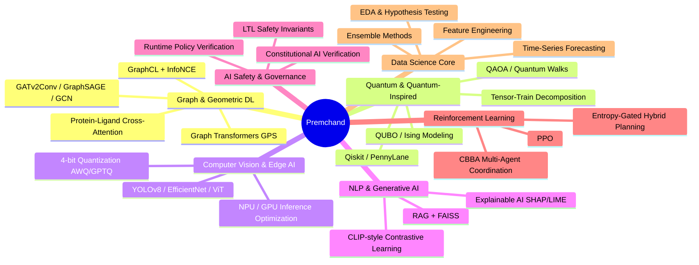
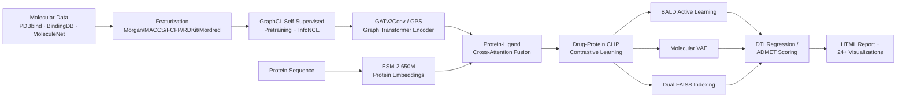
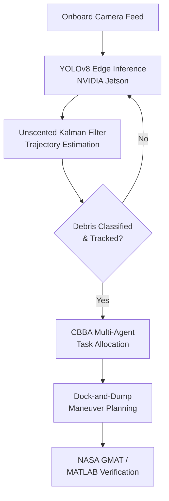
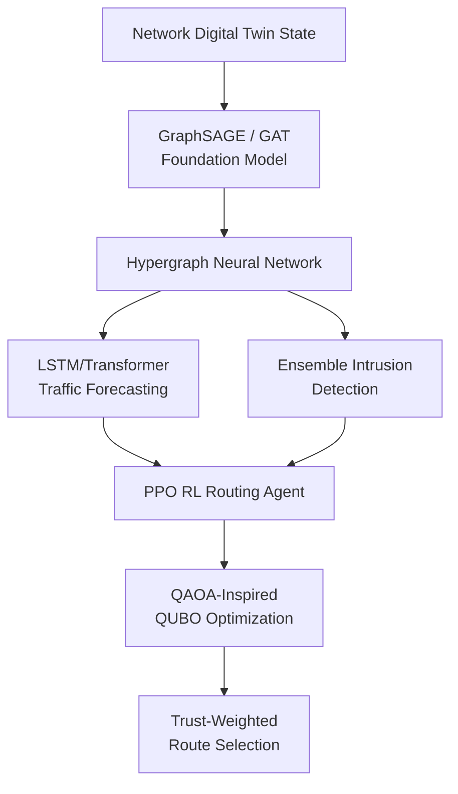
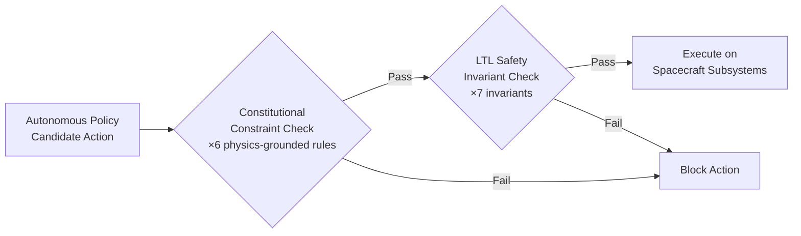
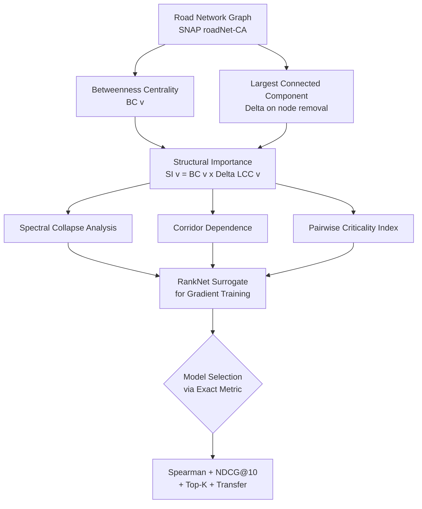
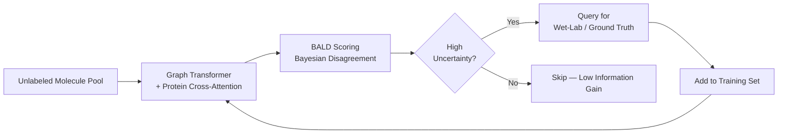
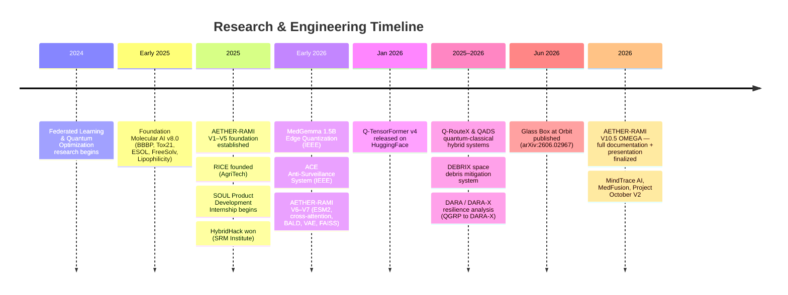

<div align="center">


[](https://rice-24.vercel.app)
[](https://linkedin.com/in/premchand-yadav)
[](https://huggingface.co/Premchan369)
[](https://scholar.google.com)
[](mailto:vcpremchandyadav@gmail.com)
[](tel:+919030822369)


</div>


<br/>

```
┌──────────────────────────────────────────────────────────────────────────┐
│  const engineer = {                                                      │
│    role: ["ML Engineer", "Data Scientist", "AI Researcher"],             │
│    focus: ["GNNs", "Quantum-Inspired ML", "Edge AI", "AI Safety"],       │
│    currentlyBuilding: "AETHER-RAMI V10.5 OMEGA — Drug Discovery GDL",     │
│    cgpa: 9.35,                                                           │
│    publications: 4,                                                     │
│    activeProjects: 13,                                                  │
│    languages: ["Python", "SQL", "JavaScript", "Java", "MATLAB"],        │
│    philosophy: "Report the verified number, not the hoped-for one."     │
│  };                                                                      │
└──────────────────────────────────────────────────────────────────────────┘
```

---

## 📑 Table of Contents

- [About Me](#-about-me)
- [Research Philosophy](#-research-philosophy)
- [Tech Stack](#️-tech-stack)
- [Publications & Frontier Research](#-publications--frontier-research)
- [Flagship Project — AETHER-RAMI](#-flagship-project--aether-rami-v105-omega)
- [Featured Projects — Deep Dives](#-featured-projects--deep-dives)
- [System Architecture Highlights](#-system-architecture-highlights)
- [Project Timeline](#-project-timeline)
- [Metrics Dashboard](#-metrics-dashboard)
- [GitHub Analytics](#-github-analytics)
- [Education](#-education)
- [Awards & Leadership](#-awards--leadership)
- [Currently Exploring](#-currently-exploring)
- [Frequently Asked Questions](#-frequently-asked-questions)
- [Let's Connect](#-lets-connect)

---

## 🧠 About Me


I'm a B.Tech Computer Science (AI & Machine Learning) student at **VIT-AP University** (CGPA 9.35/10), working closely with faculty on computational research projects, including collaborations touching CSIR-IICT Hyderabad. My work spans two modes:

- **Data-science-heavy**: statistical modeling, hypothesis testing, forecasting, business analytics — across agriculture, finance, and healthcare tabular datasets.
- **Research-style engineering**: GNNs, transformers, quantum-inspired algorithms, and runtime safety verification for autonomous systems.

I've applied both across agriculture, finance, healthcare, and space-systems datasets — treating each domain as its own EDA-to-deployment problem rather than reusing a single template.

- 🎓 B.Tech CS (AI & ML), VIT-AP University — **CGPA 9.35/10** (2023–2027)
- 🚀 Founder, **RICE** — AgriTech recommendation platform ([live →](https://rice-24.vercel.app))
- 🛰️ Co-author, *Glass Box at Orbit* — Constitutional AI verification for autonomous CubeSats (arXiv:2606.02967)
- 🧬 Building **AETHER-RAMI V10.5 OMEGA** — geometric deep-learning drug discovery platform
- 🏆 Winner, **HybridHack** @ SRM Institute (2025)
- 🧪 4 peer-reviewed publications: IEEE ×2, arXiv ×1, HuggingFace open-source release ×1
- 🧑‍💻 Product Development Intern @ **SOUL** (Sense Our Ultimate Link)
- 📍 Amaravati, Andhra Pradesh, India
- 💬 Ask me about GNN pretraining objectives, drug-target interaction pipelines, QUBO formulations, or honest ML metrics reporting

<br clear="right"/>




## 🌐 Domains I Work Across

I'm not a one-domain engineer — the same statistical/ML toolkit gets pointed at very different problems depending on the week. Here's the spread:

<div align="center">

| 🌾 AgriTech | 💰 FinTech | 🩺 HealthTech | 🛰️ SpaceTech |
|:---:|:---:|:---:|:---:|
| RICE recommendation engine, soil/market EDA | AuditX fraud detection, AlphaTrack portfolio analytics | MedFusion, MedGemma edge quantization, FHIR/ICD-10 | DEBRIX debris mitigation, Glass Box at Orbit safety |

| 🕸️ Network & Infra | ⚛️ Quantum Computing | 🧬 Computational Biology | 🌦️ Climate & Remote Sensing |
|:---:|:---:|:---:|:---:|
| Q-RouteX routing, DARA/DARA-X resilience | Q-TensorFormer, QADS, QUBO/Ising TSP | AETHER-RAMI drug discovery, protein-ligand modeling | Project October V2 multi-hazard detection |

| 🏢 Sustainability | 🧠 Cognitive Science / NLP | 🔐 Privacy & Security | ⚡ Energy Systems |
|:---:|:---:|:---:|:---:|
| OptiCampus-X campus optimization | MindTrace AI bias detection | ACE anti-surveillance, federated learning | Hybrid renewable microgrid, HOMER Pro forecasting |

</div>

> The common thread isn't the domain — it's the same discipline applied everywhere: EDA first, honest metrics, and a model that's actually validated before it's called "done."

**Also comfortable in:** sports/portfolio analytics (IPL cricket notebooks), general Kaggle competition work, and rapid-prototyping web tools for surfacing ML outputs to non-technical users (Streamlit/Gradio dashboards, deployed portfolio sites).


## 🧑‍💻 Polyglot Toolbox

Not just a Python-and-PyTorch person — the language and tool choice follows the problem:

<div align="center">


</div>

| Layer | What I reach for | Why |
|---|---|---|
| Research & modeling | Python (PyTorch, TensorFlow, scikit-learn) | Fastest path from hypothesis to trained model |
| Data pipelines & queries | SQL, Pandas | Wrangling messy tabular data before it ever touches a model |
| Simulation & control systems | MATLAB, NASA GMAT | Orbital mechanics, UKF tracking, systems verification |
| Web/product surfaces | JavaScript, HTML/CSS, Streamlit, Gradio | Turning a notebook result into something a non-ML person can actually click through (e.g. rice-24.vercel.app) |
| General-purpose/backend | Java | Coursework and structured software engineering tasks |
| Quantum circuits | Qiskit, PennyLane | Variational circuits and QAOA-style optimization |


## 🧭 Research Philosophy

Three principles show up across every project below, whether it's a Kaggle notebook or a co-authored paper:

1. **Metrics honesty over impressive numbers.** Verified benchmark runs are always reported separately from design targets or projected performance — never blended into one headline figure. This is a hard policy in AETHER-RAMI's documentation and the DARA-X quantum work alike.
2. **Differentiable surrogates for training, exact metrics for selection.** Where the "real" evaluation metric isn't differentiable (e.g. NDCG@10, Top-K overlap), training uses a differentiable surrogate (like a RankNet-style pairwise loss) for gradients, while the exact composite metric governs model selection and early stopping — not the surrogate.
3. **Frame capability honestly.** Quantum-inspired components are described as "quantum readiness" or "quantum-inspired optimization," not "quantum advantage," unless a claim can actually be backed with a fair classical baseline comparison.


## 🛠️ Tech Stack

<div align="center">


</div>

<table>
<tr>
<td valign="top" width="50%">

**Data Science & Statistics**


EDA · Hypothesis/A-B Testing · Feature Engineering · Time-Series Forecasting · Anomaly Detection · Supervised/Unsupervised Learning · Ensemble Methods

**Deep Learning & Computer Vision**


CNN · LSTM · Vision Transformers · EfficientNet · YOLOv8 · Grad-CAM/SHAP/LIME · LoRA/Adapters (Parameter-Efficient Fine-Tuning)

**Graph & Geometric Deep Learning**


GATv2Conv · GraphSAGE · GCN · Graph Transformers (GPS) · Self-Supervised Graph Contrastive Learning (GraphCL, InfoNCE) · Protein-Ligand Cross-Attention · ESM-2 Protein Language Models

**NLP & Generative AI**


BERT · GPT · LLaMA · MedGemma · Prompt Engineering · Retrieval-Augmented Generation · FAISS Vector Search · CLIP-style Contrastive Multimodal Learning

</td>
<td valign="top" width="50%">

**Reinforcement Learning & Decision Systems**


Proximal Policy Optimization (PPO) · Multi-Agent Coordination · Consensus-Based Bundle Algorithm (CBBA) · A* Search · Entropy-Gated Hybrid Planning

**Quantum & Quantum-Inspired Computing**


Quantum Machine Learning · QAOA · Quantum Walks · Variational Quantum Circuits · QUBO/Ising Modeling · Tensor-Train Decomposition

**Model Optimization & Edge AI**


4-bit Quantization (AWQ/GPTQ) · Model Pruning · Knowledge Distillation · Focal Loss for Imbalanced Data · ONNX · Edge/Mobile Deployment · NPU/GPU Inference Optimization

**AI Safety & Governance**


Constitutional AI Verification · Linear Temporal Logic (LTL) Safety Invariants · Runtime Policy Verification · Trustworthy Autonomous Systems

**Cloud, MLOps & Software Engineering**


AWS Architecture · Oracle GenAI · Docker · Git/GitHub · REST APIs · CI/CD · Agile Development · FHIR R4 · ICD-10/SNOMED Coding

**Simulation & Systems Modeling**

NASA GMAT · MATLAB · Unscented Kalman Filters (UKF) · HOMER Pro · Orbital Mechanics Simulation

</td>
</tr>
</table>

**Skill proficiency**

`Python`          `██████████` 95%
`PyTorch`         `█████████░` 90%
`Graph ML`        `█████████░` 92%
`Quantum ML`      `███████░░░` 75%
`Computer Vision` `████████░░` 82%
`NLP / RAG`       `████████░░` 80%
`Reinforcement Learning` `███████░░░` 74%
`MLOps / Cloud`   `███████░░░` 78%
`AI Safety / Formal Methods` `███████░░░` 76%


## 📄 Publications & Frontier Research

<table>
<tr><th>Title</th><th>Role</th><th>Venue</th><th>Date</th></tr>
<tr><td><b>Glass Box at Orbit</b> — Constitutional AI Verification Framework for Trustworthy Autonomous CubeSat Intelligence</td><td>Co-Author</td><td>arXiv:2606.02967 (Project October, Paper 1)</td><td>Jun 2026</td></tr>
<tr><td><b>Q-TensorFormer v4</b> — Quantum-Inspired Adaptive Transformer</td><td>Creator</td><td>HuggingFace Space</td><td>Jan 2026 – Present</td></tr>
<tr><td><b>MedGemma 1.5B Edge Quantization & Adaptation</b></td><td>Lead Researcher</td><td>IEEE Conference</td><td>Early 2026</td></tr>
<tr><td><b>ACE: Deep Learning-Based Anti-Surveillance System</b></td><td>Lead Researcher</td><td>IEEE Conference</td><td>Early 2026</td></tr>
</table>

<details>
<summary><b>🔍 Expand full publication details</b></summary>
<br/>

**Glass Box at Orbit** *(arXiv:2606.02967, Jun 2026)*
Co-authored a runtime Constitutional AI verification layer that intercepts every candidate action from an onboard autonomous AI policy for orbital data-center-scale CubeSats operating with no human in the loop. Formulated **six physics-grounded constitutional constraints** and **seven Linear Temporal Logic (LTL) safety invariants** to guarantee no unsafe command reaches spacecraft subsystems — directly addressing the governance gap in autonomous orbital AI. This is Paper 1 of the Project October series.

**Q-TensorFormer v4** *(HuggingFace Space, Jan 2026 – Present)*
Engineered a highly compressed 3-layer transformer utilizing Tensor-Train Networks, reducing parameters by **87.6%** and slashing mobile energy consumption by up to **73%** while maintaining model accuracy. Designed an Entanglement-Guided Rank Scheduler that dynamically measures Von Neumann entropy per token, intelligently routing only highly ambiguous tokens through complex computational circuits — letting "easy" tokens skip expensive compute.

**MedGemma 1.5B Edge Quantization & Adaptation** *(IEEE Conference, Early 2026)*
Successfully adapted the MedGemma 1.5B foundational model for memory-constrained edge device deployment utilizing advanced 4-bit quantization techniques. Co-authored an IEEE research paper analyzing the intricate tradeoffs between perplexity degradation, memory footprint reduction, and inference latency on NPUs and GPUs.

**ACE: Deep Learning-Based Anti-Surveillance System** *(IEEE Conference, Early 2026)*
Published research on an anti-surveillance system utilizing advanced Convolutional Neural Networks for real-time intrusion and threat detection in sensitive environments — engineered to run entirely without cloud-based computation, which matters for latency and for environments where offloading data isn't acceptable.

</details>


## 🧬 Flagship Project — AETHER-RAMI V10.5 OMEGA

**Geometric deep-learning drug discovery platform** — self-supervised pretraining, multimodal fusion, and active learning across five protein targets. Now on its 10th major iteration, evolving from a single-notebook proof of concept into a documented, benchmarked research platform.



**Targets:** EGFR · BRAF · CDK2 · HIV Protease · AChE

| Component | Detail |
|---|---|
| Pretraining | GraphCL + InfoNCE contrastive objective (Run B: successful convergence) |
| Protein encoding | ESM-2 (650M) embeddings, protein-conditioned VAE |
| Fusion | Cross-attention between molecular graph encoder and protein embeddings |
| Retrieval | Dual FAISS indexing for scalable molecular similarity search |
| Active learning | BALD (Bayesian Active Learning by Disagreement) |
| Classical ensemble | Complementary classical ML ensemble alongside the graph transformer |
| ADMET scoring | Absorption / Distribution / Metabolism / Excretion / Toxicity property prediction |
| Reporting policy | Strict metrics-honesty — verified benchmark runs kept separate from design targets |
| Documentation | 2,100+ line README; 26-slide technical presentation covering full pipeline |
| Visualization | 24+ generated visualizations, HTML report generation |

> Best benchmark run (**Run B**) achieved successful GraphCL/InfoNCE contrastive pretraining with strong DTI regression results — reported alongside, not blended with, forward-looking design targets.

<details>
<summary><b>🔍 Version history: V1 → V10.5 OMEGA</b></summary>
<br/>

| Version | Milestone |
|---|---|
| V1 – V5 | Core pipeline established: Morgan/MACCS/FCFP/RDKit/Mordred featurization, GraphCL pretraining, multi-task Graph Transformer, classical ML ensemble, protein structure parsing, DTI datasets (PDBbind, BindingDB), ADMET scoring, HTML report generation. Fixed cascading bugs — LazyModule initialization, AMP API changes, InfoNCE float16 overflow, SWA materialization, scaffold split edge cases. |
| V6 – V7 | Added ESM2-650M protein embeddings, GraphCL pretraining refinements, cross-attention fusion, BALD active learning, molecular VAE, FAISS dual indexing, 24+ visualizations. |
| V10.5 OMEGA | Finalized a large-scale 2,100+ line README with a strict metrics-honesty policy distinguishing verified runs from design targets, plus a 26-slide professional presentation covering the full pipeline end to end. |

</details>

`GNN` `GraphCL` `ESM-2` `Cross-Attention` `CLIP` `Active Learning` `FAISS` `Drug Discovery`


## 🚀 Featured Projects — Deep Dives

### 🛰️ DEBRIX — Space Debris Mitigation System
**Problem:** Autonomous tracking and removal of orbital debris without relying on constant human oversight or cloud connectivity.
**Approach:** Architected an autonomous **"Dock-and-Dump"** cyber-physical system, deploying **YOLOv8 Edge-AI** on NVIDIA Jetson hardware fused with **Unscented Kalman Filters (UKF)** for robust debris tracking under deep-space illumination conditions.
**Coordination layer:** Implemented autonomous multi-agent coordination (Swarm Intelligence) using the **Consensus-Based Bundle Algorithm (CBBA)** for decentralized mission planning.
**Verification:** Simulated and verified via MATLAB and NASA GMAT orbital mechanics tooling.
`Edge AI` `Computer Vision` `UKF` `CBBA` `NASA GMAT`

---

### ⚛️ Q-RouteX & QADS — Quantum-Classical Hybrid Intelligence Systems
**Q-RouteX** — *Trust-Aware Quantum-Inspired Hypergraph Routing for Self-Healing Internet Digital Twins*
**Problem:** Networks need routing that's resilient to failures and intrusions in real time, at scale.
**Approach:** GAT/GraphSAGE foundation model for topology representation → Hypergraph Neural Network (HGNN) for higher-order relationships → LSTM/Transformer traffic forecasting → ensemble intrusion detection → PPO-based RL routing agent → QUBO/QAOA-inspired optimization for final route selection.
**Scale target:** Benchmarked toward million-node scaling, targeting venues like IEEE INFOCOM and NeurIPS.
**Engineering reality:** Multiple AMP/API compatibility bugs fixed across sessions while scaling the notebook pipeline.

**QADS** — hybrid quantum-classical autonomous decision planner using MiniGrid, PennyLane, A*, and PPO, with entropy-gated switching between classical and quantum planners depending on decision uncertainty.
`Quantum ML` `GNN` `HGNN` `PPO` `QAOA`

---

### 🕸️ DARA / DARA-X — Dynamic Adaptive Resilience Analysis
**Problem:** Identifying the most critical nodes in large transportation/road networks (SNAP roadNet-CA and similar datasets) for resilience planning.
**Evolution:** QGRP → DARA → DARA-X, refined over multiple structured-feedback sessions with mathematical formulations pushed for honest scientific reporting.
**Core metric:** Structural Importance **SI(v) = BC(v) × ΔLCC(v)** — betweenness centrality weighted by the change in largest connected component if the node is removed.
**Richer signal:** Spectral collapse analysis, corridor dependence modeling, and a Pairwise Criticality Index.
**Training vs. selection split:** The composite training objective uses a **differentiable RankNet-style surrogate** for gradients, while the exact composite metric — Spearman correlation + NDCG@10 + Top-K overlap + transfer performance — is used only for model selection and early stopping, never for backprop.
**Framing discipline:** Adopted "**Quantum Readiness Analysis**" language instead of claiming unverified "quantum advantage."
**Outputs:** A publication-grade ~1,050-line single-cell Kaggle notebook applying the pipeline to SNAP roadNet data, plus an academic paper (LaTeX/Overleaf) co-authored with faculty, complete with a detailed metric-comparison table and inline citations.
`Graph Resilience` `RankNet` `Spectral Analysis` `Network Science`

---

### 🧠 MindTrace AI — Cognitive Bias Detector
**Problem:** Detecting cognitive biases, logical fallacies, and hidden reasoning patterns in text — and explaining *why* a passage was flagged, not just that it was.
**Approach:** Research-grade NLP framework bridging transformer-based models and Explainable AI (XAI). A Real-Time Correction XAI Layer visualizes word-level bias triggers and neutralizes text with full interpretability on why specific tokens were flagged.
**Reach:** Zero-shot multilingual transfer capabilities supporting **13+ languages** via cross-lingual transformer embeddings.
**Robustness:** An Adversarial Bias layer catches manipulative reasoning patterns that standard LLMs tend to miss.
`NLP` `XAI` `Multilingual Transformers`

---

### 🩺 MedFusion — Multimodal Clinical AI Assistant
**Problem:** Clinicians need multimodal reasoning (imaging + text) with outputs that plug into real clinical workflows, not just a chat window.
**Approach:** Combines **MedGemma** (local vision model) with **K2-Think-v2** (cloud reasoning) for a hybrid local/cloud clinical assistant.
**Clinical integration:** Clinical risk calculators, **FHIR R4** export, **ICD-10/SNOMED** coding — built to be demo-able to an actual medical colleague, not just a technical audience.
**Interface:** Gradio UI for rapid clinical review.
`Vision-Language Models` `Clinical Informatics` `FHIR`

---

### 🌍 Project October V2 — Multi-Hazard Satellite Detection
**Problem:** Detecting wildfire, flood, debris, and drought signatures from satellite imagery within tight compute budgets.
**Approach:** Single-cell Kaggle notebook pipeline paired with a Constitutional AI decision engine — a companion system to the *Glass Box at Orbit* safety framework.
**Engineering fixes:** EfficientNet-B0 downscale to respect Kaggle time limits, PyTorch 2.x AMP API updates, and albumentations version pinning to keep the augmentation pipeline reproducible.
`EfficientNet-B0` `Remote Sensing` `Constitutional AI`

---

### 🌾 RICE — AgriTech Recommendation Platform *(Founder)*
**Problem:** Farmers need actionable recommendations from noisy, heterogeneous environmental, soil, and market data.
**Approach:** Designed end-to-end ML recommendation systems transforming environmental, soil, and market tabular datasets into actionable insights. Comprehensive EDA uncovered optimization opportunities before any model was built.
**Validation:** Models built, validated, and iteratively deployed using statistical metrics rather than a single accuracy number. [Live demo →](https://rice-24.vercel.app)
`EDA` `Recommendation Systems` `AgTech`

---

### 💹 AuditX & AlphaTrack Global
**AuditX:** Anomaly detection and NLP-based analytics platform identifying fraud and abuse in enterprise financial operations, using Gemini AI alongside classical ML techniques.
**AlphaTrack Global:** Advanced portfolio tracking system handling live price ingestion, multi-currency analysis, and compliance audits for massive NASDAQ, NSE, and BSE tabular datasets.
`NLP` `Time-Series` `Fraud Detection`

---

### ⚡ Hybrid Renewable Energy Microgrid — 🏆 HybridHack Winner
**Problem:** Rural electrification needs a 24/7-reliable energy mix without over-provisioning any single source.
**Approach:** Led AI-driven system simulations for rural electrification. Implemented **LSTM-based load forecasting** using seasonal agricultural data to design an optimized energy mix, simulated in **HOMER Pro**.
**Result:** Won HybridHack at SRM Institute of Science and Technology.
`LSTM Forecasting` `HOMER Pro`

---

### 🏢 OptiCampus-X
**Problem:** Campus infrastructure (energy, water, general utilities) is usually managed reactively rather than predictively.
**Approach:** Designed a predictive sustainability platform using exploratory data analytics and ML models to optimize utilization across campus environments.
`Predictive Analytics` `Sustainability`

---

### 🔐 Federated Learning & Quantum Optimization Frameworks
**Privacy-Preserving AI:** Researching distributed machine learning for collaborative health monitoring, training models directly on wearable devices to address data heterogeneity without sharing raw user data.
**Quantum Logistics:** Formulated the Traveling Salesman Problem (TSP) as **QUBO/Ising models** to demonstrate where quantum-inspired algorithms can outperform classical solvers for real-world delivery routing.
`Federated Learning` `QUBO` `Ising Models`

---

### 🏏 IPL Cricket Analytics
**Approach:** Portfolio-oriented Kaggle notebook analyzing IPL match data — toss impact, match-phase breakdowns, and themed performance visualizations across seasons.
`EDA` `Sports Analytics`


## 🏗️ System Architecture Highlights

<details>
<summary><b>DEBRIX — Autonomous Debris Mitigation Pipeline</b></summary>


</details>

<details>
<summary><b>Q-RouteX — Trust-Aware Hypergraph Routing</b></summary>


</details>

<details>
<summary><b>Constitutional AI Verification (Glass Box at Orbit)</b></summary>


</details>

<details>
<summary><b>DARA-X — Structural Importance Scoring Pipeline</b></summary>


</details>

<details>
<summary><b>AETHER-RAMI — Active Learning Loop</b></summary>


</details>


## 🗓️ Project Timeline




## 📈 Metrics Dashboard

| Area | Metric | Value |
|---|---|---|
| Academics | CGPA (B.Tech CS – AI & ML) | **9.35 / 10** |
| Research | Peer-reviewed / published works | **4** (IEEE ×2, arXiv ×1, HF release ×1) |
| Engineering | Active/maintained project lines | **13+** |
| AETHER-RAMI | Documentation | **2,100+ line README** |
| AETHER-RAMI | Presentation | **26-slide technical deck** |
| AETHER-RAMI | Protein targets covered | **5** (EGFR, BRAF, CDK2, HIV Protease, AChE) |
| Q-TensorFormer v4 | Parameter reduction | **87.6%** |
| Q-TensorFormer v4 | Mobile energy savings | **up to 73%** |
| MindTrace AI | Languages supported (zero-shot) | **13+** |
| Glass Box at Orbit | Constitutional constraints | **6** |
| Glass Box at Orbit | LTL safety invariants | **7** |


## 📊 GitHub Analytics

<div align="center">


</div>


## 🎓 Education

**VIT-AP University**, Amaravati, AP, India
B.Tech in Computer Science (AI & Machine Learning) — **CGPA: 9.35/10** · Sep 2023 – Sep 2027
*Coursework: Machine Learning · Artificial Intelligence · Probability & Statistics · Data Structures & Algorithms · Data Analytics · Database Management Systems*

**ALLEN Career Institute**, India — Higher Secondary Education (Class XI–XII, Science), **Score: 95.9%** · Jun 2021 – Apr 2023

**Emmaus Swiss High School**, India — Secondary Education (Class X), **Score: 92.6%** · Jun 2008 – Jun 2021


## 🏆 Awards & Leadership

| | |
|---|---|
| 🥇 | **Winner, HybridHack** — SRM Institute of Science and Technology (2025). Led AI-driven simulations for a hybrid renewable energy microgrid project. |
| 📝 | **Co-Author, arXiv-Published Research** — *Glass Box at Orbit* (arXiv:2606.02967), accepted as Paper 1 of the Project October series on autonomous orbital intelligence (2026). |
| 👥 | Core Team Member, **Microsoft Student Chapter**, VIT-AP University (Dec 2023 – May 2025). Spearheaded collaborative workshops on rapid prototyping and modern AI engineering tools. |
| 🗳️ | Club Manager, **Electoral Club**, VIT-AP University (Jun 2025 – Nov 2025). Directed administrative workflows. |
| 💰 | Treasurer, **Entrepreneurship Club**, VIT-AP University (Aug 2024 – Nov 2025). Managed technical and financial resources for student-led innovation initiatives. |

**Professional Experience**

| Role | Organization | Duration |
|---|---|---|
| Founder | RICE (Revolution In Cultivating Excellence) | Jun 2025 – Present |
| Product Development Intern | SOUL (Sense Our Ultimate Link) | Apr 2025 – Present |

**Open-Source Contributions**
- 🤗 **Q-TensorFormer v4** — Tensor-Train-compressed transformer architecture published on HuggingFace with full model card and architecture documentation
- 🧬 **AETHER-RAMI** — public GitHub repository (`Premchandyadav369/AETHERRAMI`) documenting a multi-version molecular intelligence research platform with detailed architecture write-ups
- 📦 Active GitHub & HuggingFace presence — regularly publishing Kaggle notebooks and model artifacts for reproducible research across drug discovery, quantum ML, and space-systems intelligence


## 🔭 Currently Exploring

- Scaling **Q-RouteX** hypergraph routing toward million-node network digital twins
- Extending **AETHER-RAMI** with additional protein targets and richer active-learning loops
- Deeper **quantum-inspired optimization** (QAOA/QUBO) for network and logistics resilience problems
- Runtime **AI safety verification** patterns generalizable beyond CubeSat autonomy
- Tightening the **metrics-honesty documentation standard** across all active projects, not just AETHER-RAMI

<div align="center">

</div>


## 🎯 Beyond the Core Stack

A few things that don't fit neatly into "ML engineer" but shape how I work:

- 🏏 **Sports analytics as a hobby, not just a resume line** — the IPL cricket notebook exists because I find toss/phase-based performance patterns genuinely interesting, not because it was assigned.
- 📊 **Portfolio-driven learning** — most of what's above started as a Kaggle notebook or a GitHub repo built to be *shared and critiqued*, not just run once and forgotten.
- 🗂️ **Cross-club involvement on campus** — treasurer, club manager, and workshop-organizer roles alongside the technical work, because the non-technical skills (budgeting, coordination, communication) compound just as much as the technical ones.
- 🌍 **Deliberately domain-hopping** — agriculture one month, orbital mechanics the next, clinical informatics after that. The goal is a toolkit that transfers, not a narrow specialty.


## 📚 Coursework & Continuous Learning

**Formal coursework (VIT-AP University):** Machine Learning · Artificial Intelligence · Probability & Statistics · Data Structures & Algorithms · Data Analytics · Database Management Systems

**Self-directed / research-driven learning threads:**

| Track | What it covers |
|---|---|
| Geometric Deep Learning | GNNs, graph transformers, self-supervised graph pretraining |
| Quantum Computing Fundamentals | Circuit model, QAOA, QUBO/Ising formulations, tensor networks |
| Formal Methods for AI Safety | Linear Temporal Logic, runtime verification, constitutional constraints |
| Clinical Informatics Standards | FHIR R4, ICD-10, SNOMED coding |
| Edge/Embedded ML | Quantization (AWQ/GPTQ), pruning, distillation, NPU deployment constraints |
| Orbital Mechanics & Control | Kalman filtering, NASA GMAT, mission planning algorithms (CBBA) |


## ❓ Frequently Asked Questions

<details>
<summary><b>Isn't spreading across this many domains a risk instead of a strength?</b></summary>
<br/>
The domains change; the process doesn't. Every project — whether it's a drug discovery pipeline or a cricket analytics notebook — goes through the same EDA-to-validation discipline described in the Research Philosophy section above. Breadth here means one toolkit applied many places, not many shallow toolkits.
</details>


<details>
<summary><b>What's the difference between AETHER-RAMI's "verified runs" and "design targets"?</b></summary>
<br/>
Verified runs are numbers produced by an actual completed training/evaluation run, with the run identified (e.g. "Run B"). Design targets are numbers the architecture is expected to reach based on the literature or partial experiments, but haven't been fully verified end-to-end yet. The README keeps these in clearly separate sections so nobody mistakes one for the other.
</details>

<details>
<summary><b>Why "quantum-inspired" instead of "quantum" in several projects?</b></summary>
<br/>
Most of the quantum components (QAOA-style optimization, QUBO/Ising formulations, tensor-train decomposition) run on classical hardware using algorithms inspired by quantum computing principles, not on actual quantum processors. Calling this "quantum advantage" without a rigorous classical-baseline comparison would overstate the claim — so the framing stays at "quantum-inspired" or "quantum readiness" instead.
</details>

<details>
<summary><b>Are these Kaggle notebooks reproducible?</b></summary>
<br/>
Yes — most are built as single-cell, publication-grade notebooks specifically so someone can run them top to bottom without hunting for hidden state across cells. Version pinning (e.g. for albumentations) and explicit dependency handling are part of that discipline.
</details>

<details>
<summary><b>What's next for the DARA / DARA-X line of work?</b></summary>
<br/>
Continued refinement of the Structural Importance formulation and its Kaggle-notebook implementation on SNAP roadNet datasets, alongside the accompanying academic paper — with the same emphasis on separating training surrogates from the exact evaluation metric.
</details>


---

<div align="center">

## 📫 Let's Connect

[](mailto:vcpremchandyadav@gmail.com)
[](https://linkedin.com/in/premchand-yadav)
[](https://huggingface.co/Premchan369)
[](https://rice-24.vercel.app)
[](tel:+919030822369)

*"Report the verified number, not the hoped-for one — and build the thing anyway."*


</div>


