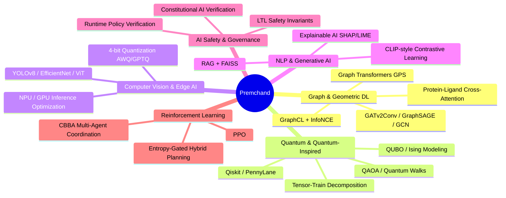
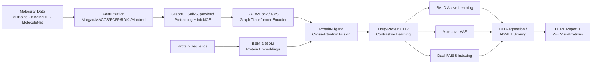
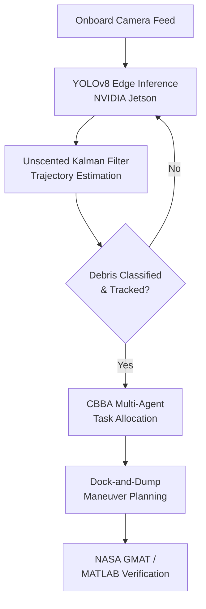
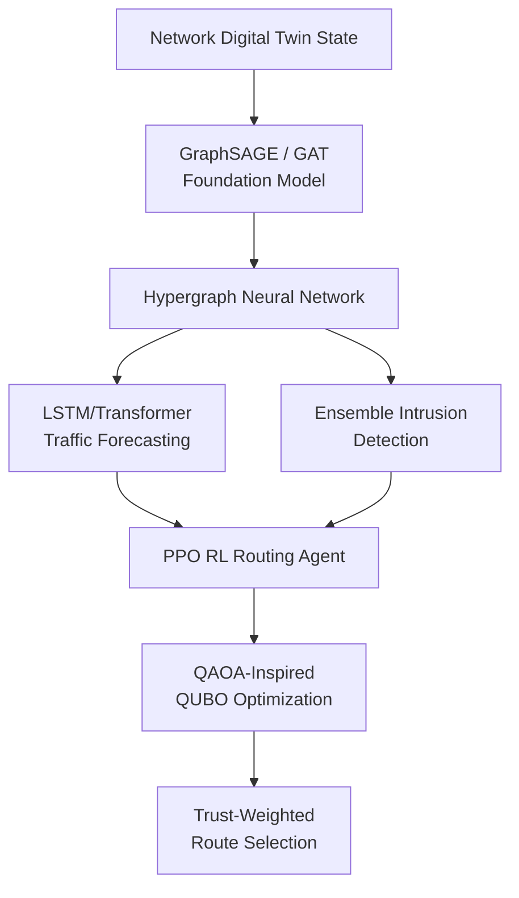
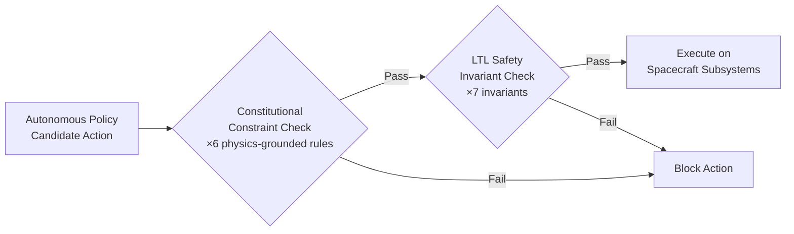

<div align="center">


<br/>

**Machine Learning Engineer • Data Scientist • AI Researcher**
Turning raw tabular, graph, and biomedical data into deployed, evaluated, honestly-reported systems.

[](https://rice-24.vercel.app)
[](https://linkedin.com/in/premchand-yadav)
[](https://huggingface.co/Premchan369)
[](https://scholar.google.com)
[](mailto:vcpremchandyadav@gmail.com)
[](tel:+919030822369)


</div>

<br/>

```
┌──────────────────────────────────────────────────────────────────────────┐
│  const engineer = {                                                      │
│    role: ["ML Engineer", "Data Scientist", "AI Researcher"],             │
│    focus: ["GNNs", "Quantum-Inspired ML", "Edge AI", "AI Safety"],       │
│    currentlyBuilding: "AETHER-RAMI V10.5 OMEGA — Drug Discovery GDL",     │
│    cgpa: 9.35,                                                           │
│    publications: 4,                                                     │
│    philosophy: "Report the verified number, not the hoped-for one."     │
│  };                                                                      │
└──────────────────────────────────────────────────────────────────────────┘
```

---

## 📑 Table of Contents

- [About Me](#-about-me)
- [Tech Stack](#️-tech-stack)
- [Publications & Frontier Research](#-publications--frontier-research)
- [Flagship Project — AETHER-RAMI](#-flagship-project--aether-rami-v105-omega)
- [Featured Projects](#-featured-projects)
- [System Architecture Highlights](#-system-architecture-highlights)
- [GitHub Analytics](#-github-analytics)
- [Education](#-education)
- [Awards & Leadership](#-awards--leadership)
- [Currently Exploring](#-currently-exploring)
- [Let's Connect](#-lets-connect)

---

## 🧠 About Me

I'm a B.Tech Computer Science (AI & Machine Learning) student at **VIT-AP University** (CGPA 9.35/10), working on research spanning graph neural networks, quantum-inspired computing, computer vision, and AI safety/governance. I move fluidly between two modes of work:

- **Data-science-heavy**: statistical modeling, hypothesis testing, forecasting, business analytics — across agriculture, finance, and healthcare tabular datasets.
- **Research-style engineering**: GNNs, transformers, quantum-inspired algorithms, and runtime safety verification for autonomous systems.



- 🎓 B.Tech CS (AI & ML), VIT-AP University — **CGPA 9.35/10** (2023–2027)
- 🚀 Founder, **RICE** — AgriTech recommendation platform ([live →](https://rice-24.vercel.app))
- 🛰️ Co-author, *Glass Box at Orbit* — Constitutional AI verification for autonomous CubeSats (arXiv:2606.02967)
- 🧬 Building **AETHER-RAMI V10.5 OMEGA** — geometric deep-learning drug discovery platform
- 🏆 Winner, **HybridHack** @ SRM Institute (2025)
- 🧪 4 peer-reviewed publications: IEEE ×2, arXiv ×1, HuggingFace open-source release ×1
- 📍 Amaravati, Andhra Pradesh, India
- 💬 Ask me about GNN pretraining objectives, drug-target interaction pipelines, QUBO formulations, or honest ML metrics reporting

---

## 🛠️ Tech Stack

<table>
<tr>
<td valign="top" width="50%">

**Data Science & Statistics**


EDA · Hypothesis/A-B Testing · Feature Engineering · Time-Series Forecasting · Anomaly Detection · Ensemble Methods

**Deep Learning & Computer Vision**


CNN · LSTM · ViT · EfficientNet · YOLOv8 · Grad-CAM/SHAP/LIME · LoRA/Adapters

**Graph & Geometric Deep Learning**


GATv2Conv · GraphSAGE · GCN · Graph Transformers (GPS) · GraphCL/InfoNCE · ESM-2 Protein LMs

</td>
<td valign="top" width="50%">

**NLP & Generative AI**


BERT/GPT/LLaMA/MedGemma · Prompt Engineering · RAG · FAISS · CLIP-style Contrastive Learning

**Reinforcement Learning & Decision Systems**


PPO · Multi-Agent CBBA · A* Search · Entropy-Gated Hybrid Planning

**Quantum & Quantum-Inspired Computing**


QAOA · Quantum Walks · Variational Quantum Circuits · QUBO/Ising · Tensor-Train Decomposition

**Model Optimization & Edge AI**


Pruning · Knowledge Distillation · Focal Loss · ONNX · NPU/GPU Inference Optimization

**Cloud, MLOps & Systems**


Oracle GenAI · CI/CD · FHIR R4 · ICD-10/SNOMED · NASA GMAT · HOMER Pro · UKF

</td>
</tr>
</table>

---

## 📄 Publications & Frontier Research

<table>
<tr><th>Title</th><th>Role</th><th>Venue</th><th>Date</th></tr>
<tr><td><b>Glass Box at Orbit</b> — Constitutional AI Verification Framework for Trustworthy Autonomous CubeSat Intelligence</td><td>Co-Author</td><td>arXiv:2606.02967 (Project October, Paper 1)</td><td>Jun 2026</td></tr>
<tr><td><b>Q-TensorFormer v4</b> — Quantum-Inspired Adaptive Transformer</td><td>Creator</td><td>HuggingFace Space</td><td>Jan 2026 – Present</td></tr>
<tr><td><b>MedGemma 1.5B Edge Quantization & Adaptation</b></td><td>Lead Researcher</td><td>IEEE Conference</td><td>Early 2026</td></tr>
<tr><td><b>ACE: Deep Learning-Based Anti-Surveillance System</b></td><td>Lead Researcher</td><td>IEEE Conference</td><td>Early 2026</td></tr>
</table>

<details>
<summary><b>🔍 Expand publication details</b></summary>

**Glass Box at Orbit** — Co-authored a runtime Constitutional AI verification layer intercepting every candidate action from an onboard autonomous AI policy for orbital data-center-scale CubeSats operating with no human in the loop. Formulated **six physics-grounded constitutional constraints** and **seven Linear Temporal Logic (LTL) safety invariants** guaranteeing no unsafe command reaches spacecraft subsystems.

**Q-TensorFormer v4** — 3-layer transformer using Tensor-Train Networks: **87.6% parameter reduction**, up to **73% lower mobile energy consumption**, accuracy maintained. Includes an Entanglement-Guided Rank Scheduler that measures per-token Von Neumann entropy to route only ambiguous tokens through complex computational circuits.

**MedGemma 1.5B Edge Quantization** — Adapted MedGemma 1.5B for memory-constrained edge deployment via 4-bit quantization (AWQ/GPTQ-style). Analyzed tradeoffs between perplexity degradation, memory footprint, and NPU/GPU inference latency.

**ACE** — CNN-based real-time intrusion/threat detection system for sensitive environments, engineered to run **without cloud-based computation**.

</details>

---

## 🧬 Flagship Project — AETHER-RAMI V10.5 OMEGA

**Geometric deep-learning drug discovery platform** — self-supervised pretraining, multimodal fusion, and active learning across five protein targets.



**Targets:** EGFR · BRAF · CDK2 · HIV Protease · AChE

| Component | Detail |
|---|---|
| Pretraining | GraphCL + InfoNCE contrastive objective (Run B: successful convergence) |
| Protein encoding | ESM-2 (650M) embeddings, protein-conditioned VAE |
| Fusion | Cross-attention between molecular graph encoder and protein embeddings |
| Retrieval | Dual FAISS indexing for scalable molecular similarity search |
| Active learning | BALD (Bayesian Active Learning by Disagreement) |
| Reporting policy | Strict metrics-honesty — verified benchmark runs kept separate from design targets |
| Documentation | 2,100+ line README; 26-slide technical presentation covering full pipeline |

> Best benchmark run (**Run B**) achieved successful GraphCL/InfoNCE contrastive pretraining with strong DTI regression results — reported alongside, not blended with, forward-looking design targets.

`GNN` `GraphCL` `ESM-2` `Cross-Attention` `CLIP` `Active Learning` `FAISS` `Drug Discovery`

---

## 🚀 Featured Projects

### 🛰️ DEBRIX — Space Debris Mitigation System
Autonomous **"Dock-and-Dump"** cyber-physical system deploying **YOLOv8 Edge-AI** on NVIDIA Jetson hardware, fused with **Unscented Kalman Filters** for robust debris tracking under deep-space illumination. Decentralized multi-agent mission planning via the **Consensus-Based Bundle Algorithm (CBBA)**, verified in MATLAB and NASA GMAT.
`Edge AI` `Computer Vision` `UKF` `CBBA` `NASA GMAT`

### ⚛️ Q-RouteX & QADS — Quantum-Classical Hybrid Intelligence
**Q-RouteX**: trust-aware quantum-inspired hypergraph routing for self-healing network digital twins — GAT/GraphSAGE foundation model, HGNN, PPO-based RL routing, QUBO/QAOA-inspired optimization, benchmarked toward million-node scaling (target venues: IEEE INFOCOM, NeurIPS).
**QADS**: hybrid quantum-classical decision planner using MiniGrid, PennyLane, A*, and PPO with entropy-gated switching between classical and quantum planners.
`Quantum ML` `GNN` `HGNN` `PPO` `QAOA`

### 🕸️ DARA / DARA-X — Dynamic Adaptive Resilience Analysis
Critical node identification in transportation and road networks (SNAP roadNet datasets), co-authored with faculty. Core design: **Structural Importance** SI(v) = BC(v) × ΔLCC(v), spectral collapse analysis, corridor dependence, and Pairwise Criticality Index. Composite training objective uses a differentiable RankNet-style surrogate for gradients, while the exact metric (Spearman + NDCG@10 + Top-K overlap + transfer) governs model selection. Framed as **Quantum Readiness Analysis** rather than claiming unverified quantum advantage.
`Graph Resilience` `RankNet` `Spectral Analysis` `Network Science`

### 🧠 MindTrace AI — Cognitive Bias Detector
Research-grade NLP framework bridging transformers and Explainable AI to detect cognitive biases, logical fallacies, and manipulative reasoning in text. Real-time correction XAI layer visualizing word-level bias triggers; zero-shot multilingual transfer across **13+ languages**; adversarial bias detection layer.
`NLP` `XAI` `Multilingual Transformers`

### 🩺 MedFusion — Multimodal Clinical AI Assistant
Combines **MedGemma** (local vision model) with **K2-Think-v2** (cloud reasoning) — clinical risk calculators, FHIR R4 export, ICD-10/SNOMED coding, Gradio UI built for medical-colleague demos.
`Vision-Language Models` `Clinical Informatics` `FHIR`

### 🌍 Project October V2 — Multi-Hazard Satellite Detection
Single-cell pipeline for wildfire, flood, debris, and drought detection from satellite imagery, paired with a Constitutional AI decision engine (companion to the *Glass Box at Orbit* safety framework).
`EfficientNet-B0` `Remote Sensing` `Constitutional AI`

### 🌾 RICE — AgriTech Recommendation Platform *(Founder)*
End-to-end ML recommendation system transforming environmental, soil, and market data into actionable insights for farmers. [Live demo →](https://rice-24.vercel.app)
`EDA` `Recommendation Systems` `AgTech`

### 💹 AuditX & AlphaTrack Global
**AuditX**: anomaly detection + NLP-based fraud/abuse analytics for enterprise finance (Gemini AI). **AlphaTrack Global**: portfolio tracker with live price ingestion, multi-currency analysis, and compliance auditing across NASDAQ, NSE, BSE.
`NLP` `Time-Series` `Fraud Detection`

### ⚡ Hybrid Renewable Energy Microgrid — 🏆 HybridHack Winner
LSTM-based load forecasting on seasonal agricultural data for 24/7-optimized rural electrification energy mix.
`LSTM Forecasting` `HOMER Pro`

### 🏢 OptiCampus-X
Predictive sustainability platform optimizing campus energy, water, and infrastructure utilization.
`Predictive Analytics` `Sustainability`

### 🔐 Federated Learning & Quantum Optimization
Privacy-preserving distributed ML for collaborative wearable health monitoring (no raw data sharing); TSP formulated as QUBO/Ising models for quantum-inspired delivery routing.
`Federated Learning` `QUBO` `Ising Models`

### 🏏 IPL Cricket Analytics
Portfolio Kaggle notebook — toss impact, match-phase breakdowns, and performance visualizations across IPL seasons.
`EDA` `Sports Analytics`

---

## 🏗️ System Architecture Highlights

<details>
<summary><b>DEBRIX — Autonomous Debris Mitigation Pipeline</b></summary>


</details>

<details>
<summary><b>Q-RouteX — Trust-Aware Hypergraph Routing</b></summary>


</details>

<details>
<summary><b>Constitutional AI Verification (Glass Box at Orbit)</b></summary>


</details>

---

## 📊 GitHub Analytics

<div align="center">


</div>

---

## 🎓 Education

**VIT-AP University**, Amaravati, AP, India
B.Tech in Computer Science (AI & Machine Learning) — **CGPA: 9.35/10** · Sep 2023 – Sep 2027
*Coursework: Machine Learning · Artificial Intelligence · Probability & Statistics · Data Structures & Algorithms · Data Analytics · Database Management Systems*

**ALLEN Career Institute**, India — Higher Secondary (Science), **95.9%** · Jun 2021 – Apr 2023
**Emmaus Swiss High School**, India — Secondary Education, **92.6%** · Jun 2008 – Jun 2021

---

## 🏆 Awards & Leadership

| | |
|---|---|
| 🥇 | **Winner, HybridHack** — SRM Institute of Science and Technology (2025) |
| 📝 | **Co-Author, arXiv-Published Research** — *Glass Box at Orbit* (2026) |
| 👥 | Core Team Member, **Microsoft Student Chapter**, VIT-AP (Dec 2023 – May 2025) |
| 🗳️ | Club Manager, **Electoral Club**, VIT-AP (Jun 2025 – Nov 2025) |
| 💰 | Treasurer, **Entrepreneurship Club**, VIT-AP (Aug 2024 – Nov 2025) |

**Open-Source Contributions**
- 🤗 **Q-TensorFormer v4** — Tensor-Train-compressed transformer, published on HuggingFace with full model card
- 🧬 **AETHER-RAMI** — public GitHub repo documenting a multi-version molecular intelligence research platform
- 📦 Active GitHub & HuggingFace presence — Kaggle notebooks and model artifacts for reproducible research in drug discovery, quantum ML, and space-systems intelligence

---

## 🔭 Currently Exploring

- Scaling **Q-RouteX** hypergraph routing toward million-node network digital twins
- Extending **AETHER-RAMI** with additional protein targets and richer active-learning loops
- Deeper **quantum-inspired optimization** (QAOA/QUBO) for network and logistics resilience problems
- Runtime **AI safety verification** patterns generalizable beyond CubeSat autonomy

---

<div align="center">

## 📫 Let's Connect

[](mailto:vcpremchandyadav@gmail.com)
[](https://linkedin.com/in/premchand-yadav)
[](https://huggingface.co/Premchan369)
[](https://rice-24.vercel.app)

*"Report the verified number, not the hoped-for one — and build the thing anyway."*


</div>
